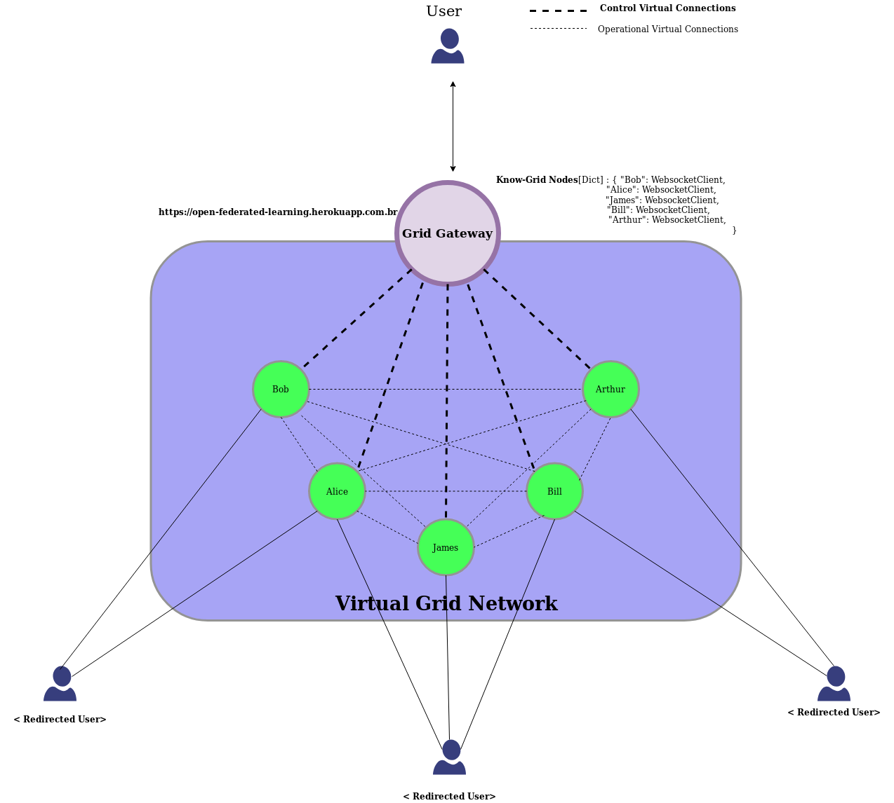
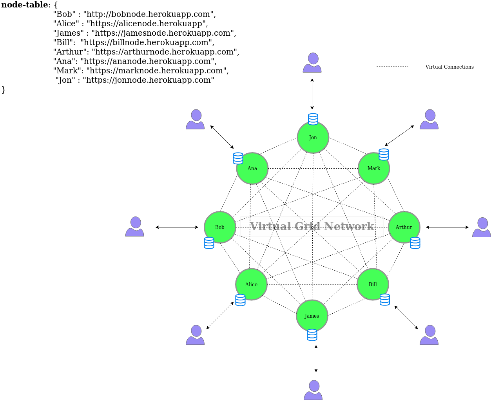

# Grid Platform

| Status        | (Proposed)       |
:-------------- |:---------------------------------------------------- |
| **Author(s)** | Ionesio Junior (ionesiojr@gmail.com)                 |
| **Sponsor**   | Ionesio Junior (ionesiojr@gmail.com)                 |
| **Updated**   | 2019-08-21                                           |

## Objective
 - Create a secure and collaborative federated learning platform.
 - Train,share and manage models/datasets in a distributed, collaborative and secure way.
 - Understand grid platform concept and discuss about strategies to implement it.


## Motivation

Grid platform aim's to be a secure peer to peer platform used to train, manage and share models. We want to use pysyft's features to perform federated  learning processes without neeed to manage distributed workers directly. Nowadays, to perform some machine learning process using syft library, the user needs to manage directly all the workers stuff (start nodes, manage node connections, turn off nodes, etc). Our purpose is build a platform that will do this in a transparent way. The user won't need to know about how the nodes are connected or what node have some specific dataset.


## User Benefit

We will have a distributed and collaborative platform to share datasets and perform machine learning processes in a easy and secure way.

## Design Proposal

### Partially Distributed
This is our simpliest design. We will have a two types of components (Grid Gateway and  Grid Node).


#### Grid Gateway
Grid Gateway works like a special DNS component (but it will route nodes by queries instead of domain names).  
To do that, it needs to know the node's adress and id of all grid nodes connected on our grid network.
If someone wants to perform any computation/query on our grid network, the grid gateway will be the first component to be asked.

#### Grid Node
The Grid node works like a standard remote worker used in syft, we added a rest api (used by gateway) to perform simple queries without need to maintain a websocket connection.

**It's important to emphasize**: the grid gateway won't be able to perform any computation process on the nodes. It can't concentrate or centralize any data or model.

#### Advantages
- Lower complexity.
- Easy scalability ( to add new nodes, we only need to update the list of know nodes on grid gateway component ).
- The network won't be overheadead by control messages.
- Connections between grid nodes can be made by demand (They don't need to maintain several thread processes to maintain all connections in a keep-alive status).
- User authentication at node level.

#### Disadvantages
- If our grid gateway crashes, we will lost our grid network.
- All query requests will be centralized at grid network.

### Fully Distributed
In this purpose, we'll use an approach similar to distributed hash table concept to map every node on our grid network using their ids.
<br>We will have only grid nodes components, but now, every node on the grid network will act like gateway component too.


##### Advantages
- Homogeneous architecture.
- Fully distributed and descentralized.
- User authentication at node level.
- Fault tolerant (if some node crashes, we still have the network).
- Connections between grid nodes can be made by demand (They don't need to maintain several thread processes to maintain all connections in a keep-alive status).
 
##### Disadvantages
- High complexity.
- The network can be overheadead by control messages. (update/join/remove messages propagated on the network)
- Less scalability (to add/remove nodes, we will need to propagate this on the network).

## Detailed Design

### How to join in the network?
To do this, after some node starts it needs to perform a request to grid gateway.
<br>The API used to do that:  
**URL** : `/join`  
**Method** : `POST`  
**Auth required** : NO (can be changed)  
**Data constraints**:  
```json
{
    "node-id": "Bob", 
    "node-address": "http://bobnode.herokuapp.com" 
}
```
After that,the grid gateway component knows who's bob.  
**Development status** : DONE

### How to search specific dataset on the grid network?
If some user wants to know where is a specific tagged data. It needs to perform a request to grid gateway. After that, the grid gateway will broadcast a search request on the registered nodes and returns a list of node adresses that have the desired dataset.
<br>The API used to do that:  
**URL** : `/search`  
**Method** : `POST`  
**Auth required** : NO (can be changed)  
**Data constraints**:  
```json
{
    "query": ["#MNIST", "#boston-housing"]
}
```
##### Success Response

**Code** : `200 OK`

**Content example**

```json
{
    "node-addresses": [ ["Bob", "http://bobnode.herokuapp.com"], ["Alice", "http://alicenode.herokuapp.com"] ]
}
```
After that, the client needs to connect directly to each grid node to perform some computation.  
**Development status**: DONE

### How to maintain grid network updated?
The grid gateway need to constantly send health check requests to verify if nodes are alive. To do that, we will need to send simple pings to every know nodes.
<br>The API used to do that:  
**URL** : `/health-check`  
**Method** : `GET`  
**Auth required** : NO  
**Development status** : OPEN

## Related resources
[About Distributed Hash Table Architecture](https://medium.com/@michael.dufel_10220/distributed-hash-tables-and-why-they-are-better-than-blockchain-for-exchanging-health-records-d469534cc2a5)